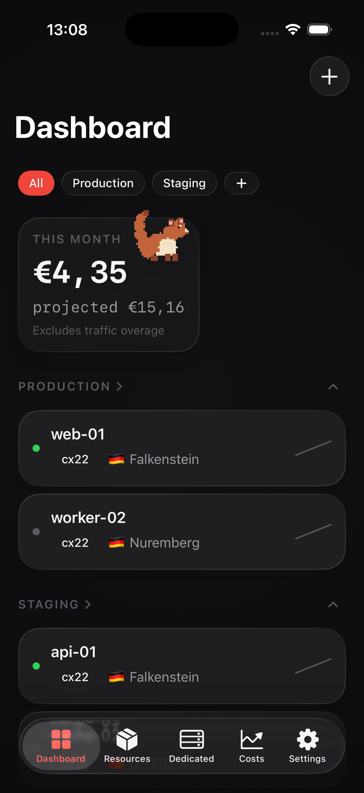
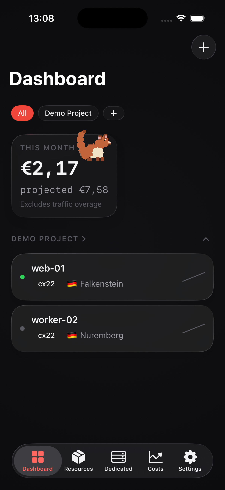

# Hetzly

A premium, open-source iOS client for Hetzner Cloud, Robot, and Storage Boxes — no backend server
of Hetzly's own, no telemetry, and (aside from one opt-in feature described below) no third-party
dependencies.

> **Not affiliated.** Hetzly is an independent third-party app, not affiliated with or endorsed by Hetzner Online GmbH. "Hetzner" is a trademark of Hetzner Online GmbH.

<!-- screenshot: dashboard-dark.png -->
<!-- screenshot: server-detail-dark.png -->
<!-- screenshot: create-server-wizard-dark.png -->
<!-- screenshot: robot-servers-dark.png -->
<!-- screenshot: storage-boxes-dark.png -->
<!-- screenshot: terminal-dark.png -->
<!-- screenshot: cost-dashboard-dark.png -->
<!-- screenshot: widgets-dark.png -->

<p>
  
  
</p>

See [Screenshots](#screenshots) below for exactly how these are generated. The two embedded above
are real captures; the rest are placeholders to be filled in before publishing (see
[PUBLICATION-CHECKLIST.md](PUBLICATION-CHECKLIST.md)).

## Why

Hetzner's own mobile experience is a web view. Hetzly is a native SwiftUI app built for iOS 26, with Liquid Glass UI, dark-first design (with a light-mode option), and no server of its own sitting between you and the Hetzner API. Your API tokens never leave your device.

## Features

- **Cloud — full CRUD coverage**: servers, volumes, networks, firewalls, load balancers, DNS zones, images, snapshots, floating IPs, primary IPs, placement groups, SSH keys, certificates, and a guided **create-server wizard** (location → image → type → networking → SSH keys → review).
- **Server management**: power actions, rescue mode, rebuild, resize, backups, snapshots, protection locks, labels, console access, and live CPU/disk/network metrics with sparklines.
- **Robot — dedicated servers**: server management, hardware/software reset, Wake-on-LAN, rescue mode, boot configuration, reverse DNS, vSwitch and failover IP routing, and **ordering new dedicated servers** (standard and server-market catalogs) directly from the app, with transaction tracking.
- **Storage Boxes**: account management, usage and quota visibility, subaccounts, snapshots, and access configuration for Hetzner Storage Boxes.
- **In-app SSH terminal**: an opt-in, full SSH terminal to your Cloud and Robot servers, built on SwiftNIO-SSH and SwiftTerm — see [Dependencies](#dependencies) below. Off by default; only the Terminal feature pulls these packages in.
- **Cost dashboard**: spend across every Cloud project, Robot account, and Storage Box account, computed entirely on-device from live resource + pricing data — nothing is sent to a third-party billing service. CSV export. Manual price overrides and manual cost entries for spend the Hetzner API can't expose (see [Security model](#security-model)).
- **Home Screen widgets**: at-a-glance fleet status and top servers by CPU, built from an on-device snapshot — no network access from the widget extension itself.
- **Siri & Shortcuts (App Intents)**: check server status, reboot a server, and read this month's cost burn, hands-free or from the Shortcuts app.
- **Mascot**: Hetzi, a small pixel-art red panda companion that reacts to what's happening in your infrastructure (idle, alarm, celebrate, work, and more) — fully optional, toggle it off in Settings and it disappears everywhere, including loading/empty/error illustrations. See [ASSETS-LICENSE.md](ASSETS-LICENSE.md) for the sprite licensing situation before you redistribute this repository.
- **Multi-project**: any number of Cloud projects, Robot accounts, and Storage Box accounts side by side, with a cross-account Dashboard rollup and search.

## Architecture

```
.
├── project.yml                  # XcodeGen spec — source of truth for the Xcode project
├── Hetzly/                      # App target
│   ├── App/                     # Entry point, DI container (AppContainer), root view, settings,
│   │                             # centralized outbound links (AppLinks.swift)
│   ├── DesignSystem/            # Colors, spacing, glass components, shared views
│   ├── Features/                # Feature modules: Dashboard, Servers, Resources (volumes/
│   │                             # networks/firewalls/LB/DNS/...), Dedicated (Robot + Ordering),
│   │                             # StorageBoxes, Terminal (in-app SSH), Costs, Invoices,
│   │                             # CreateServer, Onboarding, Settings
│   ├── Intents/                 # App Intents (Siri/Shortcuts) — status, reboot, cost queries
│   ├── Mascot/                  # Pixel-art mascot rendering (Canvas-drawn, no bitmap assets)
│   ├── Security/                # Keychain, biometrics, privacy overlay, sensitive pasteboard
│   ├── Store/                   # SwiftData-backed local state (projects, Robot accounts,
│   │                             # Storage Box accounts, snapshots)
│   └── Resources/               # Asset catalog, Info.plist
├── HetzlyWidgets/                # WidgetKit extension: status + top-servers widgets
├── Packages/
│   └── HetznerKit/               # UI-free SPM package: Hetzner Cloud + Robot API client + pricing engine
├── HetzlyTests/ / HetzlyUITests/ # App-target unit and UI test targets
└── .github/workflows/            # CI
```

**HetznerKit** (`Packages/HetznerKit/`) is a UI-free Swift package that owns everything network- and
model-shaped: `Core/` (HTTP client, rate limiter, pagination, error mapping), `CloudAPI/` (the full
Hetzner Cloud surface), `RobotAPI/` (the Hetzner Robot webservice, including ordering, vSwitches, and
failover IPs), and `Pricing/` (a pure, deterministic on-device cost engine). It builds and tests
independently of the app (`swift test --package-path Packages/HetznerKit`), targets both iOS and
macOS so its test suite runs on any dev machine or CI runner without a simulator, and has no
dependency on SwiftUI, UIKit, or the app target — every model is `Sendable` and `Codable` with
explicit `CodingKeys`, and unknown enum values (new server states, new product types, etc.) decode to
`.unknown` rather than throwing, so a change on Hetzner's side degrades gracefully instead of
crashing the app. HetznerKit itself has zero third-party dependencies.

## Dependencies

The core app and HetznerKit are dependency-free — every line of networking, JSON decoding, keychain
access, rate limiting, and pixel-art rendering outside the Terminal feature is Apple frameworks + the
Swift standard library, hand-written and readable end to end. This is a deliberate constraint, not an
oversight — see [CONTRIBUTING.md](CONTRIBUTING.md#the-dependency-rule) for the reasoning.

The one exception: the **optional in-app SSH terminal** (`Hetzly/Features/Terminal/`) uses two
third-party packages, scoped to that feature only:

- [`apple/swift-nio-ssh`](https://github.com/apple/swift-nio-ssh) (Apache 2.0) — the SSH transport,
  plus its transitive SwiftNIO / swift-crypto dependencies.
- [`migueldeicaza/SwiftTerm`](https://github.com/migueldeicaza/SwiftTerm) (MIT) — the terminal
  emulator view.

Both are permissively licensed and pulled in automatically by Swift Package Manager (see
[Building](#building) below) — writing an SSH client and a VT100-class terminal emulator from
scratch was judged out of scope, unlike the rest of the app. Everything else — including the app's
core privacy claim ("your token never leaves your device, through code you can read yourself") — is
still something you can verify by reading the source without auditing a dependency tree.

## Security model

- **Keychain, not UserDefaults.** Cloud API tokens and Robot credentials are stored via
  `KeychainStore` (`Hetzly/Security/KeychainStore.swift`) with
  `kSecAttrAccessibleWhenUnlockedThisDeviceOnly` — decryptable only on this device, only while
  unlocked, excluded from iCloud Keychain sync and from device backups that carry Keychain data.
- **Face ID / Touch ID gating.** Revealing a stored token and any destructive action (deleting a
  server, resetting a dedicated server, disabling rescue mode, ordering hardware, ...) goes through
  `BiometricGate` — biometrics with passcode fallback. Destructive-action gating is a toggle in
  Settings; hardware ordering is **always** gated regardless of that toggle, and is additionally
  double-confirmed with a review screen before Face ID is even requested.
- **Single-attempt Robot login.** Hetzner's Robot web login locks an account out after a handful of
  failed attempts, and Robot has no scoped-token equivalent of Cloud's API tokens — so Hetzly
  deliberately does not retry a failed Robot username/password submission. One attempt, surfaced
  immediately on failure so you can correct input by hand.
- **Serialized, budgeted Robot queue.** Every Robot request goes through one serialized queue inside
  `RobotClient` — never more than one in-flight request at a time, a conservative ~150 requests/hour
  token-bucket budget, and a 5-minute response cache on GETs. There is no background polling of
  either the Cloud or Robot APIs; every fetch is either explicit (pull-to-refresh, opening a screen)
  or a deliberate, capped background snapshot for widgets.
- **Privacy overlay.** The app content is blurred behind `PrivacyOverlay` whenever the app isn't in
  the foreground (`scenePhase != .active`), so server names, IPs, and balances don't sit exposed in
  the iOS app switcher.
- **Sensitive pasteboard expiry.** Anything copied to the clipboard that's short-lived and sensitive
  (a freshly revealed rescue password, a generated SSH private key) goes through
  `SensitivePasteboard`, which sets `.localOnly` and an automatic expiration (default 60s) on the
  pasteboard item rather than leaving it there indefinitely.
- **No telemetry, no analytics, no crash reporters.** The app makes network requests to the Hetzner
  Cloud and Robot APIs only — direct device-to-Hetzner, nothing in between, no Hetzly-run backend of
  any kind. No `NSAllowsArbitraryLoads` or per-domain ATS exceptions; all traffic is TLS.
- **No secret logging.** `print`/`os_log`/`Logger` calls touching `Authorization` headers or
  credential-bearing bodies are disallowed by convention and enforced by a CI grep guard.
- **Manual price overrides are local-only.** Hetzner's API doesn't expose grandfathered/legacy
  per-server pricing (older Robot contracts, in particular), so Hetzly lets you enter those prices by
  hand (`Hetzly/Features/Costs/DedicatedPriceStore.swift`) and stores them purely on-device — nothing
  is submitted anywhere; it only changes what the on-device cost dashboard displays.
- App Store privacy label: **Data Not Collected**.
- See [SECURITY.md](SECURITY.md) for the full model and how to report a vulnerability.

## Building

Requirements: Xcode 26.5, [XcodeGen](https://github.com/yonaskolb/XcodeGen).

```sh
brew install xcodegen
xcodegen
open Hetzly.xcodeproj
```

The `.xcodeproj` is generated from [`project.yml`](project.yml) and is **not** committed — re-run
`xcodegen` any time `project.yml` or the file layout changes.

Two Swift Package Manager dependencies (`swift-nio-ssh` and `SwiftTerm`, see
[Dependencies](#dependencies) above) are declared in `project.yml` and resolve automatically the
first time Xcode opens or builds the generated project — no manual `File > Add Package Dependencies`
step needed.

**Widgets on personal devices without App Groups provisioning:** `project.yml` currently has the
`HetzlyWidgets` extension's `embed: true` dependency (and its matching entitlements line) commented
out with a `TEMPORARY` note. That's a workaround for building to a physical device on an Apple
Developer account that hasn't yet accepted the App Groups entitlement's latest Program License
Agreement — with it commented out, the app builds and runs without the widget extension embedded or
the App Groups capability. If your account has App Groups available (this is the normal case,
including CI and the simulator), uncomment those two lines in `project.yml` before running
`xcodegen` so the widgets actually ship.

## Testing

HetznerKit (the API/model layer) is UI-free and runs anywhere Swift runs:

```sh
swift test --package-path Packages/HetznerKit
```

The app target's unit and UI tests (`HetzlyTests`, `HetzlyUITests`) need a simulator, via `xcodebuild`:

```sh
xcodegen
xcodebuild test \
  -project Hetzly.xcodeproj \
  -scheme Hetzly \
  -destination 'platform=iOS Simulator,name=iPhone 17 Pro,OS=26.5'
```

CI (`.github/workflows/ci.yml`) runs both, plus a release build with `CODE_SIGNING_ALLOWED=NO`, on
every PR and push to `main`.

## Screenshots

Screenshots referenced above are captured from the iOS Simulator, not staged mockups.

The two Dashboard screenshots embedded at the top of this README (`docs/screenshots/dashboard.png`,
`docs/screenshots/single-project.png`) are captured automatically by
[`scripts/capture_screenshots.sh`](scripts/capture_screenshots.sh) — it boots the iPhone 17 Pro (iOS
26.5) simulator, builds and installs a Debug build, and launches it twice with the same
`HETZLY_UITEST_MULTI`/`HETZLY_UITEST` fixture-seed flags `HetzlyUITests` uses (see
`Hetzly/App/UITestSupport.swift`), landing on the Dashboard tab both times with no manual navigation
needed:

```sh
./scripts/capture_screenshots.sh
```

Deeper screens (server detail, create-server wizard, cost dashboard, dedicated servers, Storage
Boxes, in-app terminal, widgets) need either manual navigation in the simulator or a dedicated
XCUITest driving `XCUIScreen.main.screenshot()` — neither is wired up by that script, and remain a
manual/App-Store-pipeline step below, and are currently placeholders in this README (marked with
HTML comments above). To regenerate those (the `fastlane/screenshots/en-US/*-dark.png` set used for
App Store submission):

```sh
# Boot a clean iPhone 17 Pro simulator at the target OS
xcrun simctl boot "iPhone 17 Pro" 2>/dev/null || true
xcrun simctl bootstatus "iPhone 17 Pro" -b

# Build and install a Debug build (see "Building" above for the xcodegen step)
xcodebuild build \
  -project Hetzly.xcodeproj -scheme Hetzly \
  -destination 'platform=iOS Simulator,name=iPhone 17 Pro,OS=26.5' \
  -derivedDataPath build
xcrun simctl install "iPhone 17 Pro" build/Build/Products/Debug-iphonesimulator/Hetzly.app
xcrun simctl launch "iPhone 17 Pro" com.hetzly.app

# Force dark appearance and take a screenshot once you've navigated to the
# screen you want (repeat per screen: dashboard, server detail, create-server
# wizard, dedicated servers, Storage Boxes, in-app terminal, cost dashboard,
# widgets gallery)
xcrun simctl ui "iPhone 17 Pro" appearance dark
xcrun simctl io "iPhone 17 Pro" screenshot fastlane/screenshots/en-US/dashboard-dark.png
```

Widget screenshots: long-press the Home Screen in the simulator, add the Hetzly widget, then use the
same `simctl io ... screenshot` command. `fastlane/screenshots/` and `fastlane/report.xml` are
gitignored — see [`fastlane/README.md`](fastlane/README.md) for the metadata/screenshots pipeline
used for App Store submission.

## App icon

`app-icon.png` at the repository root is the source artwork for Hetzly's new primary app icon — the
project's own red panda logo, independent of the Elthen-derived mascot sprite pack (see
[ASSETS-LICENSE.md](ASSETS-LICENSE.md)). It's intentionally tracked in git (see
[`.gitignore`](.gitignore)) as source artwork rather than a build product. **As of this writing the
`AppIcon*.appiconset` catalogs under `Hetzly/Resources/Assets.xcassets/` have not yet been
regenerated from it** — see [ASSETS-LICENSE.md](ASSETS-LICENSE.md) for why that regeneration also
doubles as (part of) the mascot-licensing publication blocker.

## Roadmap

- **M1 — Scaffold**: project skeleton, design system, security primitives, HetznerKit core.
- **M2 — Cloud read + write**: full Cloud resource browsing, server actions, create-server wizard, all
  secondary resources (volumes, networks, firewalls, load balancers, DNS, SSH keys, certificates).
- **M3 — Robot + cost dashboard**: dedicated server management and ordering, on-device cost
  aggregation across Cloud and Robot.
- **M4 — Polish & submission**: Home Screen widgets, Siri/Shortcuts App Intents, mascot behavior
  rules and accessibility pass, App Store submission assets.
- **Post-M4 — Multi-project overhaul**: Storage Boxes, Robot vSwitch/failover IP routing, CSV export,
  adaptive light mode, in-app SSH terminal, manual price overrides, and a round of UX polish.
- **Later**: additional locales, deeper widget configurability.

## Contributing

See [CONTRIBUTING.md](CONTRIBUTING.md).

## Disclaimer

Hetzly is provided "as is," without warranty of any kind — see [LICENSE](LICENSE). It is an
independent, community-built client and is not affiliated with, endorsed by, or supported by Hetzner
Online GmbH. Use of the Hetzner Cloud and Robot APIs through this app is subject to Hetzner's own
terms of service. Destructive actions (deleting servers, resetting hardware, ordering paid dedicated
servers) are irreversible or billable — review what you're confirming before you confirm it.

## License

MIT — see [LICENSE](LICENSE). Note that the mascot sprite assets have a separate, more restrictive
license — see [ASSETS-LICENSE.md](ASSETS-LICENSE.md) before redistributing this repository.

Hetzner runs an [Open Source & Cloud Native program](https://www.hetzner.com/unternehmen/open-source-cloud-native/) that provides cloud resources to qualifying open-source projects; contributions and sponsorship inquiries related to that program are welcome via GitHub issues.
