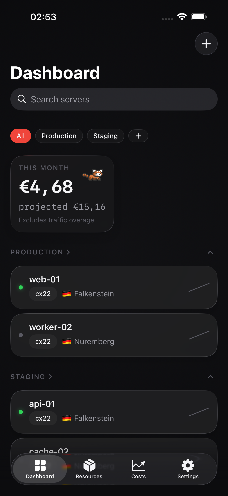
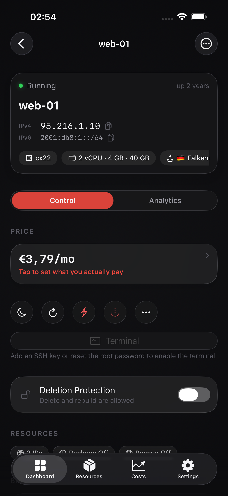
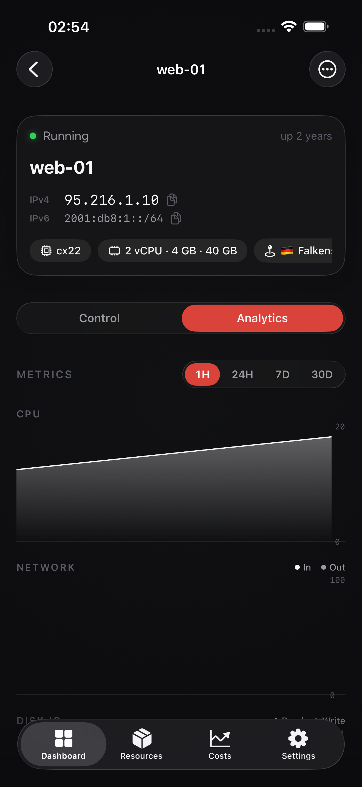
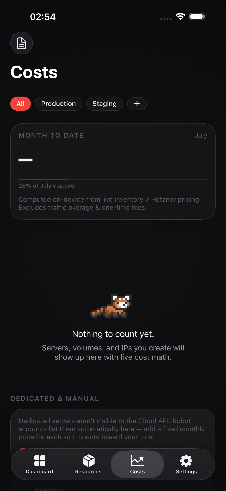
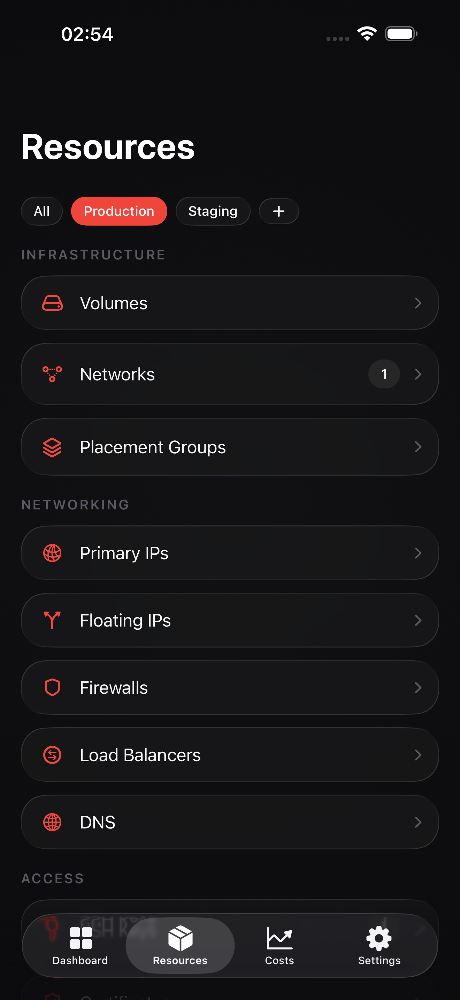
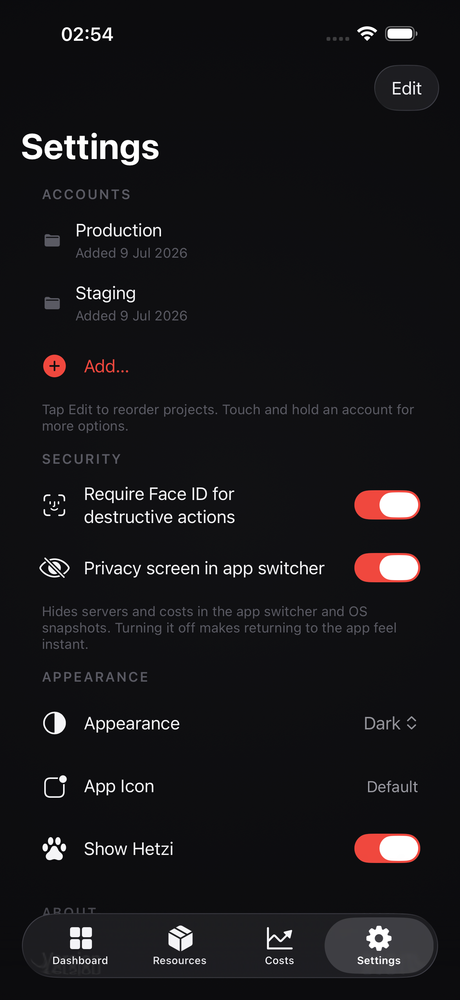

<div align="center">


# Hetzly

**A premium, native iOS client for Hetzner Cloud, Robot & Storage Boxes.**
Zero backend. Zero telemetry. Your tokens never leave your device.

[](https://www.apple.com/ios/)
[](https://swift.org)
[](LICENSE)
[](PRIVACY.md)

</div>

---

Hetzly puts your entire Hetzner infrastructure in your pocket — manage Cloud servers, order and control Robot dedicated machines, browse Storage Boxes, watch live metrics, and track your real monthly spend — all from a fast, dark, native SwiftUI app built for iOS 26 and Liquid Glass. Every request goes straight from your phone to Hetzner's API. There is no server of ours in the middle, no analytics SDK, and nothing to sign up for.

<div align="center">

<table>
  <tr>
    <td></td>
    <td></td>
    <td></td>
  </tr>
  <tr>
    <td align="center"><sub>Multi-project dashboard</sub></td>
    <td align="center"><sub>Server control panel</sub></td>
    <td align="center"><sub>Live metrics</sub></td>
  </tr>
  <tr>
    <td></td>
    <td></td>
    <td></td>
  </tr>
  <tr>
    <td align="center"><sub>On-device cost dashboard</sub></td>
    <td align="center"><sub>Resources hub</sub></td>
    <td align="center"><sub>Multi-account settings</sub></td>
  </tr>
</table>

</div>

## Features

**Hetzner Cloud — full coverage**
- Dashboard aggregated across unlimited projects, with search, per-project scoping, and at-a-glance status
- Create & manage servers: power actions, rebuild, rescale (with a guided shutdown→resize→power-on flow), rescue mode, snapshots & backups, ISO attach, protection, rename & labels
- A guided **create-server wizard** with live pricing (location → image → type → config)
- Volumes, networks, firewalls (a genuinely usable mobile rule editor), load balancers with metrics, floating & primary IPs, DNS zones, SSH keys (generate Ed25519 keys on-device), certificates, placement groups
- Live CPU / network / disk **metrics charts** you can scrub

**Robot — dedicated servers**
- List, detail, reset (sw/hw/man, explained in plain language), Wake-on-LAN, rescue mode, reverse DNS, vSwitches, failover IPs
- Browse the **server market** and order a dedicated machine from your phone — behind a deliberate, double-confirmed, Face-ID-gated flow

**Storage Boxes** — usage, snapshots, subaccounts, protocol toggles, password resets on Hetzner's new API.

**Built-in SSH terminal** — connect straight to a server with a real in-app terminal (SwiftNIO-SSH + SwiftTerm), authenticating with an on-device key or the saved root password.

**Cost dashboard, computed 100% on your device** — Hetzner has no billing API, so Hetzly derives your monthly burn from live inventory × pricing. Since the API can't reveal *grandfathered* per-server prices, you can set the **real price you pay** per server and see it reflected everywhere. Export CSV or a shareable image.

**Everywhere else** — home & lock-screen **widgets**, **Siri Shortcuts** (reboot, status, monthly cost), `hetzly://` **deep links**, action-completion **notifications**, light & dark themes, full VoiceOver/Dynamic Type support, and **Hetzi** the red-panda mascot.

## Privacy & security

This is the whole point. See [PRIVACY.md](PRIVACY.md) and [SECURITY.md](SECURITY.md).

- **No backend.** Every call is device → Hetzner. There is no server of ours anywhere in the path.
- **No telemetry, no analytics, no crash SDKs.** App Store privacy label: *Data Not Collected.*
- **Tokens live in the Keychain** (`ThisDeviceOnly`, non-synchronizable) — never in logs, URLs, iCloud, or SwiftData.
- **Destructive & paid actions** require explicit confirmation and optional Face ID; ordering a dedicated server always does.
- **Robot's 1-login-attempt limit** is respected; requests are serialized and rate-budgeted.

## Tech

- **SwiftUI**, Swift 6 (strict concurrency), **iOS 26** minimum — real Liquid Glass APIs, not fake blurs
- **`HetznerKit`** — a self-contained, UI-free, dependency-free Swift package wrapping the Cloud, Robot & Storage Box APIs, with ~320 unit tests
- The **only** third-party dependencies are `apple/swift-nio-ssh` and `migueldeicaza/SwiftTerm`, used solely by the optional in-app SSH terminal. The core app and `HetznerKit` are dependency-free.
- Project generated with [XcodeGen](https://github.com/yonaskolb/XcodeGen)

## Build

```sh
brew install xcodegen
xcodegen                 # generates Hetzly.xcodeproj
open Hetzly.xcodeproj    # ⌘R — Swift Package deps resolve automatically
```

Requires **Xcode 26.5+**. Add a Hetzner Cloud API token in-app (Console → Security → API tokens) to get started — Read-only for monitoring, Read & Write to control things.

> **Note:** the widget extension needs the App Groups capability; on Apple accounts where that isn't provisioned yet, the widget target is commented out in `project.yml` (see the note there) so the app itself still builds and runs.

Run the tests:

```sh
swift test --package-path Packages/HetznerKit
xcodebuild test -project Hetzly.xcodeproj -scheme Hetzly \
  -destination 'platform=iOS Simulator,name=iPhone 17 Pro,OS=26.5' CODE_SIGNING_ALLOWED=NO
```

## Roadmap

- In-app VNC console (currently: credentials shown for use with a VNC client)
- Historical cost trends
- CPU threshold alerts
- iPad layout

## License

MIT — see [LICENSE](LICENSE). Mascot sprites by [Elthen](https://elthen.itch.io/2d-pixel-art-red-panda-sprites), used with permission.

**Hetzly is an independent third-party app. It is not affiliated with, endorsed by, or sponsored by Hetzner Online GmbH.** "Hetzner" is a trademark of Hetzner Online GmbH.
